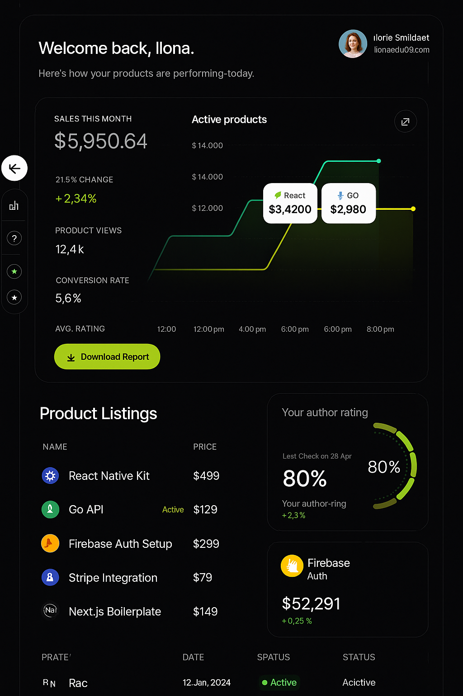

# DevBazaar

DevBazaar is a marketplace platform for buying and selling developer toolkits, resources, and blogs. Built with Next.js, it features authentication, admin and seller dashboards, toolkit uploads, blog management, and more.

## Features

- User authentication (sign up, login, NextAuth)
- Admin dashboard for managing sellers, blogs, and toolkits
- Seller dashboard for uploading and managing toolkits
- Blog creation and management
- Toolkit detail pages with file/image uploads
- Filtering and searching toolkits
- Responsive UI with modern design


## Images

Add screenshots or GIFs of your project here to showcase the UI and features. For example:




## Getting Started

### 1. Install dependencies

```bash
npm install
# or
yarn install
```

### 2. Set up environment variables

Create a `.env.local` file in the root directory and add the following variables:

```env
# MongoDB connection string
MONGODB_URI=your_mongodb_connection_string

# NextAuth secret and providers
NEXTAUTH_SECRET=your_nextauth_secret
NEXTAUTH_URL=http://localhost:3000

# AWS S3 (if using file uploads)
AWS_ACCESS_KEY_ID=your_aws_access_key_id
AWS_SECRET_ACCESS_KEY=your_aws_secret_access_key
AWS_REGION=your_aws_region
AWS_BUCKET_NAME=your_bucket_name
```

> **Note:** Only add the AWS variables if you plan to use AWS S3 for file uploads.

### 3. Run the development server

```bash
npm run dev
# or
yarn dev
# or
pnpm dev
# or
bun dev
```

Open [http://localhost:3000](http://localhost:3000) with your browser to see the result.

---

## Project Structure

- `src/app/` - Main app routes and pages
- `src/component/` - Reusable UI and feature components
- `src/lib/` - Utility and config files (e.g., MongoDB, AWS)
- `src/api/` - API route handlers (auth, blogs, toolkits, etc.)